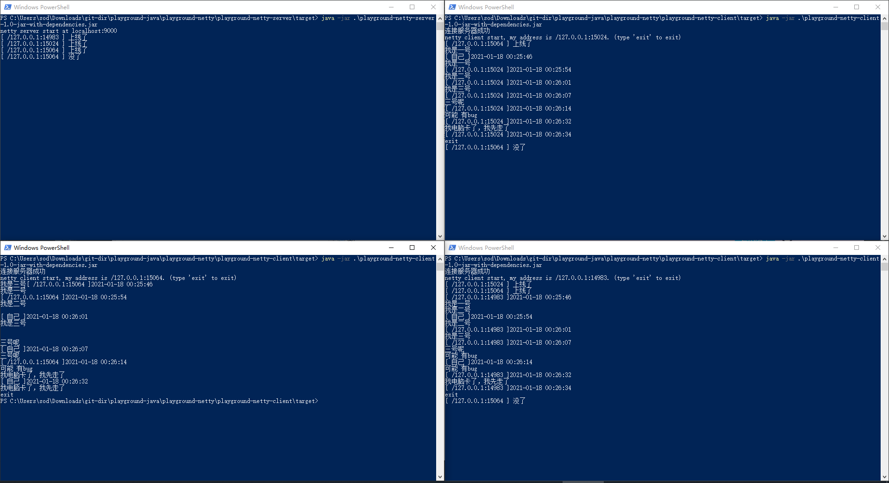

# playground-netty

netty 实战项目，聊天室

## 启动项目

> 项目默认使用 **jdk14** 编译，如果需要使用其他版本的jdk请自行配置
> `maven.compiler.source` 和 `maven.compiler.target` 

1. 程序打包
    ```bash
    mvn clean
    mvn package
    ```
2. 启动服务器端(需要占用`9000`端口)
    ```bash
   java -jar playground-netty-server/target/playground-netty-server-1.0-jar-with-dependencies.jar
   ```
3. 启动客户端(可以多开几个客户端，这样看得出来客户端间通信)
    ```bash
   java -jar playground-netty-client/target/playground-netty-client-1.0-jar-with-dependencies.jar
   ```
## 效果图
