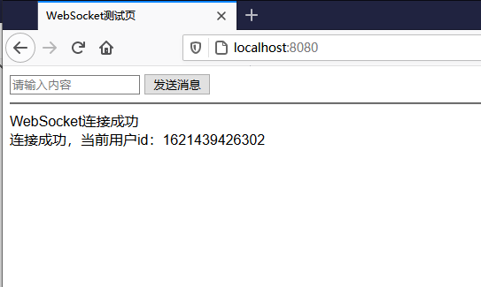
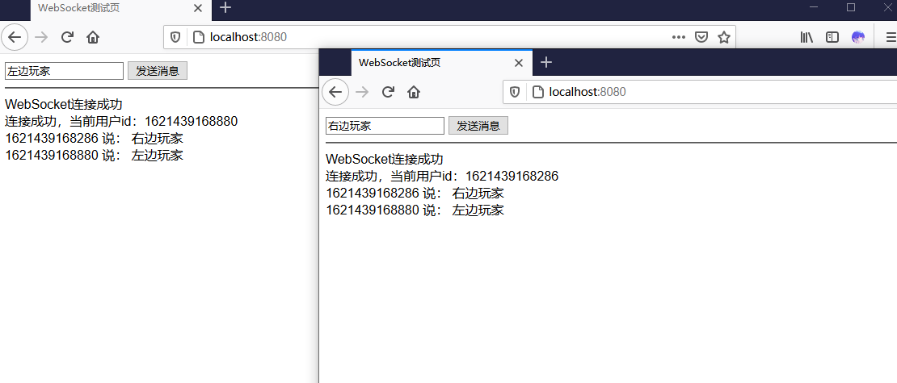
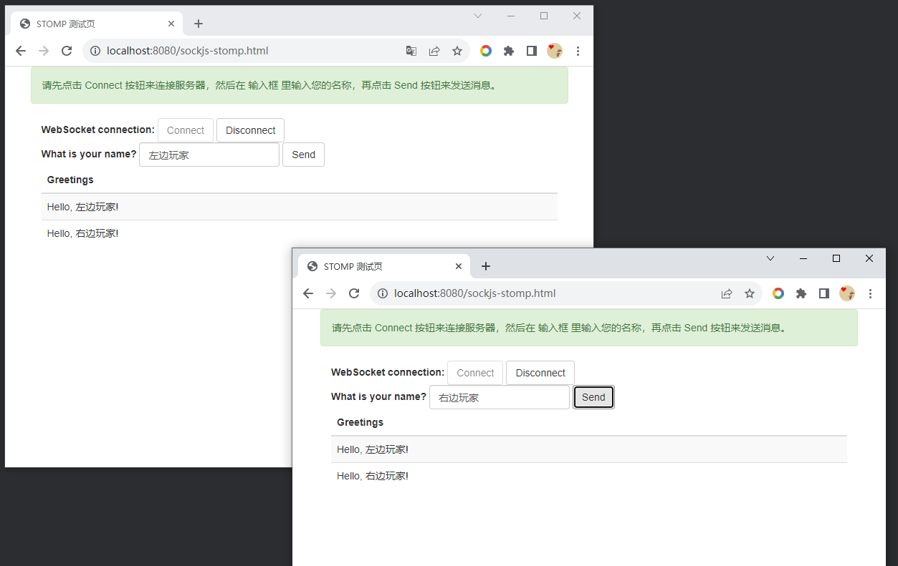

# playground-spring-boot-websocket

websocket 示例demo

## 启动方法

```bash
mvn spring-boot:run
```

启动完成之后访问 http://localhost:8080 可以进行默认页面，选择技术栈

进入 http://localhost:8080/plain-text.html



启动两个页面，然后可以互相发消息



- - -

基于Websocket, http://localhost:8080/sockjs-stomp.html 页面提供了使用SockJS实现的 STOMP 协议参考, 它也可以实现多端实时通信



### Reference Documentation

For further reference, please consider the following sections:

* [Official Apache Maven documentation](https://maven.apache.org/guides/index.html)
* [Spring Boot Maven Plugin Reference Guide](https://docs.spring.io/spring-boot/docs/2.7.14/maven-plugin/reference/html/)
* [Create an OCI image](https://docs.spring.io/spring-boot/docs/2.7.14/maven-plugin/reference/html/#build-image)
* [WebSocket](https://docs.spring.io/spring-boot/docs/2.7.14/reference/htmlsinge/index.html#messaging.websockets)
- [SpringBoot集成Web Socket，实现后台向前端推送信息](https://mp.weixin.qq.com/s/mXvilrGVu4x30-pAWKlhMw)
- [springboot整合websocket（四）上传文件（终篇）](https://blog.csdn.net/qq_44938451/article/details/121226239)
- [SockJS简单介绍](https://blog.csdn.net/john_62/article/details/78208177)
- [springboot整合websocket实现一对一消息推送和广播消息推送](https://segmentfault.com/a/1190000011908831) STOMP功能

### Guides

The following guides illustrate how to use some features concretely:

* [Using WebSocket to build an interactive web application](https://spring.io/guides/gs/messaging-stomp-websocket/)
