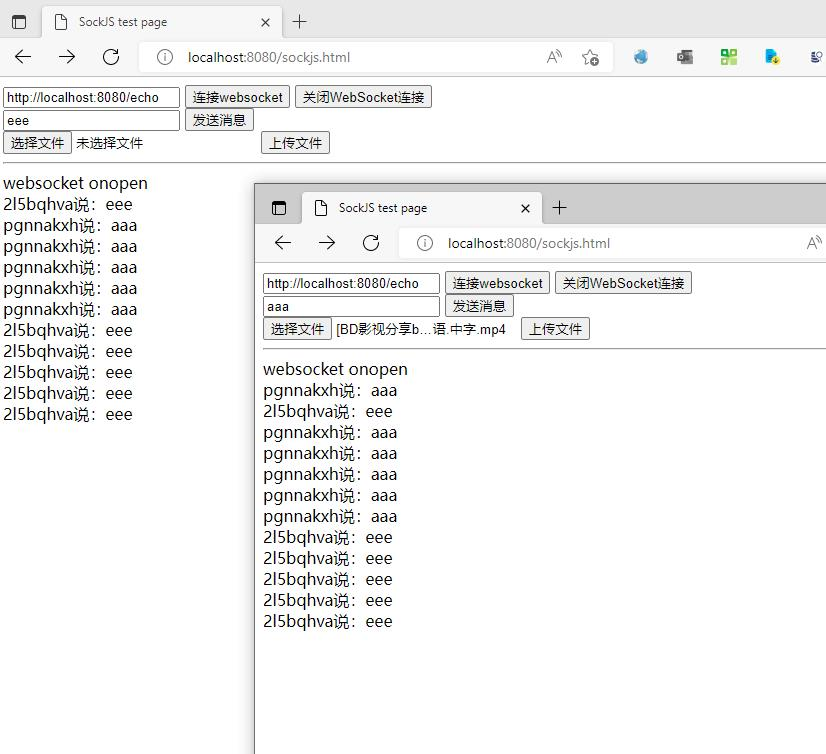

# playground-spring-boot-websocket

websocket 示例demo

## 启动方法

```bash
mvn spring-boot:run
```

启动完成之后访问 http://localhost:8080 可以进行默认页面，选择技术栈

进入 http://localhost:8080/plain-text.html


启动两个页面，然后可以互相发消息


- - -

另一个技术栈使用了 SockJS 来搭建，也是 Spring 内置的模块，访问地址为 http://localhost:8080/sockjs.html



## 参考链接

- [SpringBoot集成Web Socket，实现后台向前端推送信息](https://mp.weixin.qq.com/s/mXvilrGVu4x30-pAWKlhMw)
- [springboot整合websocket（四）上传文件（终篇）](https://blog.csdn.net/qq_44938451/article/details/121226239)
- [SockJS简单介绍](https://blog.csdn.net/john_62/article/details/78208177)
- [springboot整合websocket实现一对一消息推送和广播消息推送](https://segmentfault.com/a/1190000011908831) STOMP功能