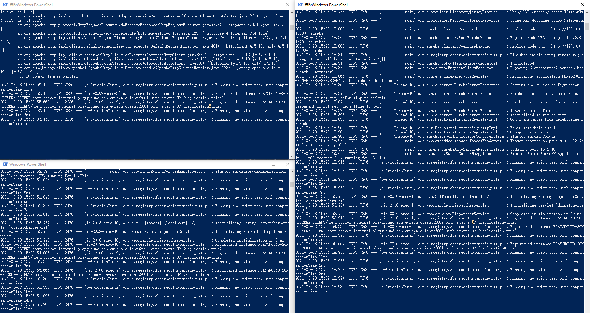
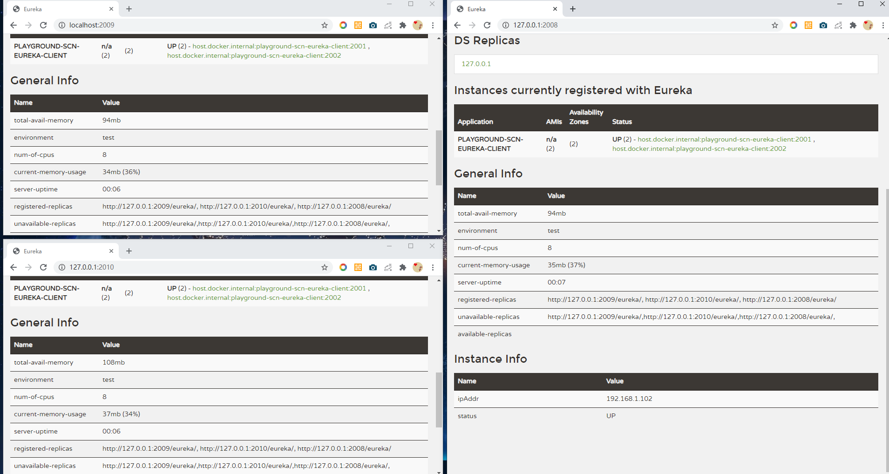
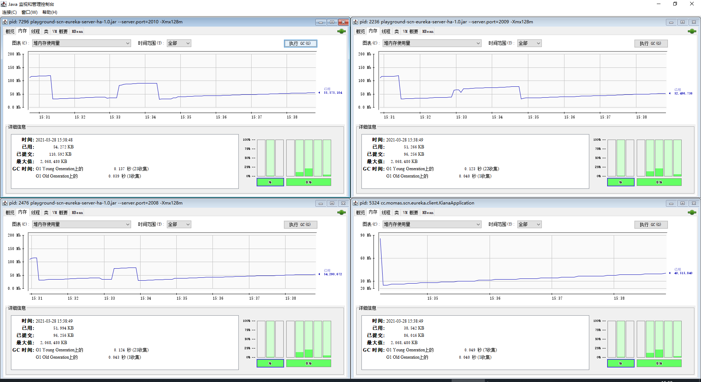

# playground-scn-eureka-server-ha
高可用的 eureka 注册中心服务端

## 启动方法

1. 打包

```
mvn package
```

2. 启动2008、2009、2010三个端口

```
java -jar .\target\playground-scn-eureka-server-ha-1.0.jar --server.port=2008 -Xmx128m
java -jar .\target\playground-scn-eureka-server-ha-1.0.jar --server.port=2009 -Xmx128m
java -jar .\target\playground-scn-eureka-server-ha-1.0.jar --server.port=2010 -Xmx128m
```

3. 客户端连接注册中心时不再连接到单独的注册中心，而是连接到集群，修改 `eureka.client.service-url.defaultZone` 属性

```
# 客户端的 application.properties里
eureka.client.service-url.defaultZone=http://127.0.0.1:2008/eureka/,http://127.0.0.1:2009/eureka/,http://127.0.0.1:2010/eureka/
```

## 启动成功示例图




## 参考资料
- [史上最简单的SpringCloud教程 | 第十篇: 高可用的服务注册中心(Finchley版本)](https://blog.csdn.net/forezp/article/details/81041101)
- [Spring Cloud服务注册-Eureka介绍和部署](http://www.heartthinkdo.com/?p=1933)
- [Spring Cloud Netflix](https://cloud.spring.io/spring-cloud-netflix/reference/html/) spring 官方提供的 eureka 文档
- [Eureka REST operations](https://github.com/Netflix/eureka/wiki/Eureka-REST-operations) Eureka 的RESTful接口，用于服务上线下线等
- [Appendix A: Common application properties](https://cloud.spring.io/spring-cloud-netflix/reference/html/appendix.html) eureka的配置项