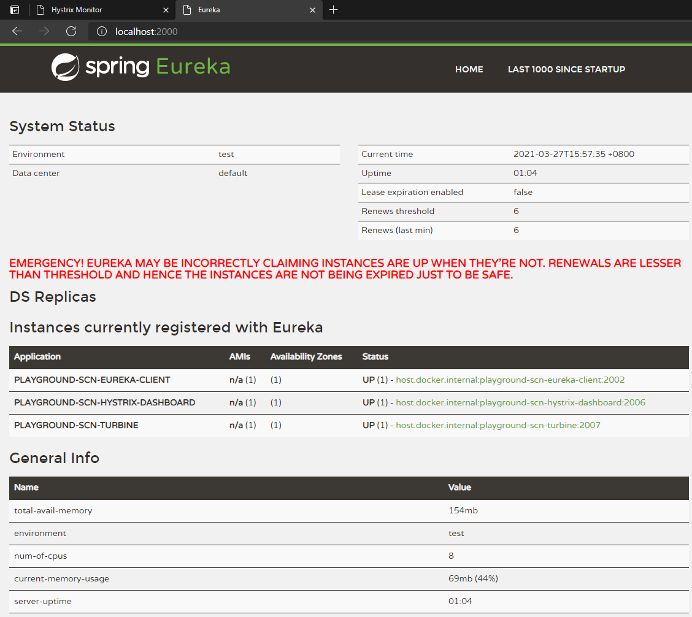
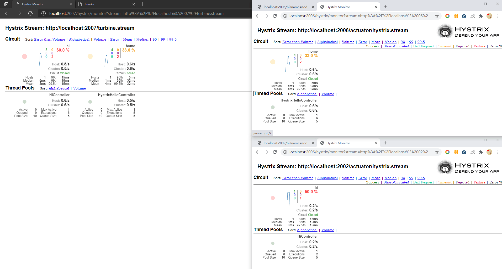

# playground-scn-turbine

Hystrix 多服务监控

# 测试url

url | remark
---|---
http://localhost:2006/hi?name=sod | 服务B的接口(hystrix客户端)
http://localhost:2006/hystrix/monitor?stream=http%3A%2F%2Flocalhost%3A2006%2Factuator%2Fhystrix.stream | 服务B的监控
http://localhost:2002/hi?name=sod | 服务A的接口(hystrix客户端)
http://localhost:2006/hystrix/monitor?stream=http%3A%2F%2Flocalhost%3A2002%2Factuator%2Fhystrix.stream | 服务A的监控
http://localhost:2007/hystrix/monitor?stream=http%3A%2F%2Flocalhost%3A2007%2Fturbine.stream | 所有服务的监控(hystrix服务端，也就是turbine)

# 启动成功画面

# 参考资料 
- [Hystrix Turbine简介与使用](https://blog.csdn.net/weixin_42914675/article/details/84297949)
- [springcloud(五)：熔断监控Hystrix Dashboard和Turbine](http://www.ityouknow.com/springcloud/2017/05/18/hystrix-dashboard-turbine.html)
