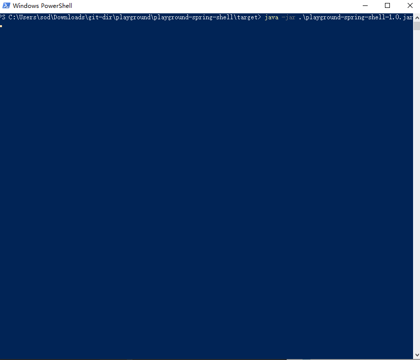
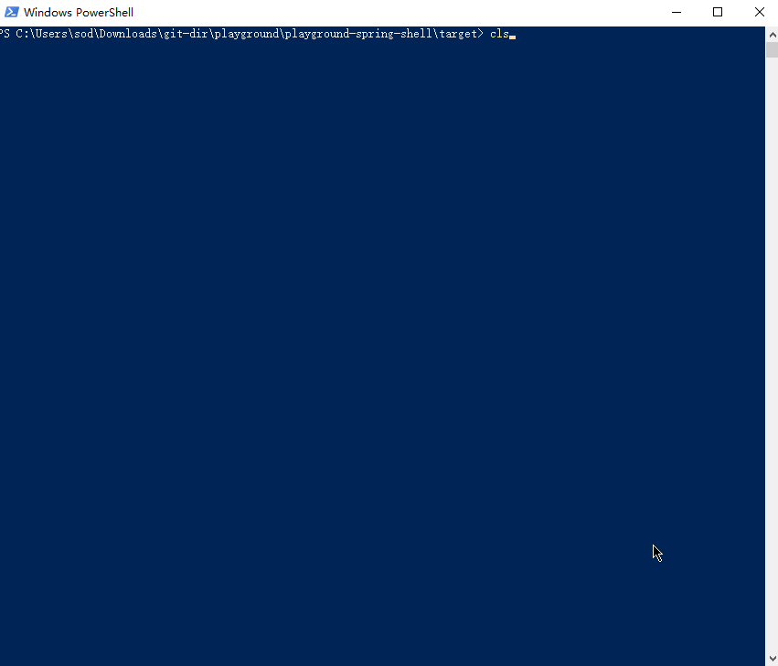

# playground-spring-shell

Spring Shell 示例

## 启动项目

>  spring shell 本质是生成了一个命令行程序，用于执行各种实用逻辑

TwoSumCommand 类演示了个最简单的命令执行，参数按顺序传入，返回了结果打印出来
```shell
# cc.momas.spring.shell.TwoSumCommand
shell:>add 1 2
3
```

ConnectCommand 类演示了一个需要**状态**的程序，需要先`连接`，才能`下载`，`断开连接`后，也无法`下载`
```shell
# cc.momas.spring.shell.ConnectCommand

shell:>downloadd
Command 'download' exists but is not currently available because you are not connected
Details of the error have been omitted. You can use the stacktrace command to print the full stacktrace.
shell:>connect
Missing option, longnames='user', shortnames=''
Missing option, longnames='password', shortnames=''
shell:>connect root 123456
connected!
shell:>download
downloading...
downloaded.
shell:>disconnect
disconnected!
shell:>download
Command 'download' exists but is not currently available because you are not connected
Details of the error have been omitted. You can use the stacktrace command to print the full stacktrace.
```

cc.momas.spring.shell.FlowComponentCommand 类实现了交互式的选择输入，文字表达不清楚，看图感受





除了自己编写的命令，spring shell 也自带了一些命令，例如 `help` 帮助命令, `exit` 退出程序命令等，更详情内容请查看 [Spring Shell 参考文档](https://docs.spring.io/spring-shell/docs/2.1.1/site/reference/htmlsingle/)

## reference

- [Spring Shell入门介绍 ](https://www.cnblogs.com/nuccch/p/11067342.html)
- [Spring Shell 参考文档](https://docs.spring.io/spring-shell/docs/2.1.1/site/reference/htmlsingle/)